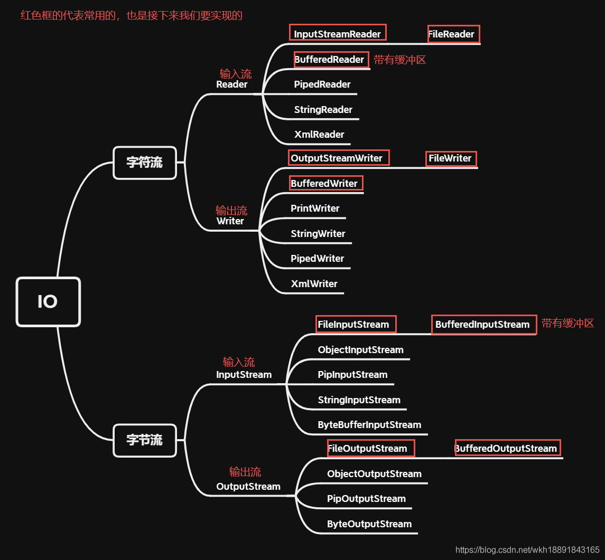

从JAVA反射技术到Spring AOP

# I/O流

# 参考

1. [用Java实现基于Socket的网络编程](https://blog.csdn.net/weixin_42643216/article/details/103206804?utm_medium=distribute.pc_relevant.none-task-blog-2~default~baidujs_title~default-0-103206804-blog-114040362.pc_relevant_antiscanv3&spm=1001.2101.3001.4242.1&utm_relevant_index=3)
2. [字节流和字符流详解](https://blog.csdn.net/wkh18891843165/article/details/115310276)
3. [Java socket详解,看这一篇就够了](https://blog.csdn.net/weixin_46535927/article/details/118975864)